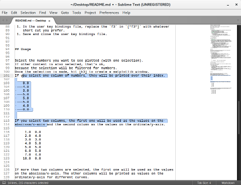
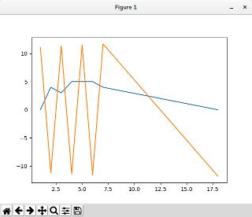

PlotGraph - A Sublime Text 3 Package
====================================

Plot a column of numbers as a graph, or create a quick curve comparison 
based on multiple number columns.

##Installation

### Requirements

 -  You need a [python](https://www.python.org/downloads/release/python-360/) 
    installation on your computer. 
    The sublime-internal python is not sufficient.
 -  That python environment needs to have the following modules installed:
    -   [matplotlib](http://matplotlib.org/),
    -   [argparse](https://docs.python.org/3/library/argparse.html)
    -   [ast](https://docs.python.org/3/library/ast.html)  

    The latter two are part of the python standard library and are probably 
    available with a standard python installation.

 -  To test if your python installation has a module installed, 
     you can do the following:
    -   Open a terminal.
    -   Start python, e.g. by entering `python` and hit [Enter].
    -   In the started python console, enter e.g.: `import matplotlib`.
    -   If this command finished without an error message you are all set.

### Install Using PackageControl 

 -  *not available yet*

### Manual Installation

 1. Download the 
     [zip archive](https://github.com/tibsel/PlotGraph/archive/master.zip).
 1. Extract the folder `PlotGraph-master` from the downloaded zip archive.
 1. Rename the folder to `PlotGraph`.
 1. Copy the renamed folder into Sublime Text's `Packages` directory.
 
    -   If you are not sure where to find that directory, 
        go to Sublime Text 3 `Menu > Preferences > Browse Packages...`.
        This should open a directory in you browser. 
 1. Restart Sublime Text 3.


## Setup

Once PlotGraph is installed, you need to set the path to your local python 
installation (in which matplotlib and the other modules are working).

### Define Python Executable Path

 1. Open Sublime Text 3.
 1. In the menu navigate to 
     `Preferences > Package Settings > PlotGraph > Settings - User`.
     If you are accessing the PlotGraph user settings for the first time, 
     that file will be empty.
 1.    To get a template for the possible settings, open 
     `Preferences > Package Settings > PlotGraph > Settings - Default`.
 1. Copy the content of the default PlotGraph settings 
     to the empty user settings file.
 1. Replace the default value for `python_exec` with the path to your python 
     executable.
     The content of your PlotGraph user setting file should look 
    somewhat like this:  

    ```json
    {     
        "python_exec" : "<path to your python executable>"
    }
    ```

 1. Save and close the PlotGraph user settings file.

### Set Key Bindings

If your are not happy with using `[ctrl+alt+g]` as the short cut to 
generate the plot, you can change the key binding:

 1. Open Sublime Text 3.
 1. In the menu navigate to 
    `Preferences > Package Settings > PlotGraph > Key Bindings - Default`.
 1. Copy the line `{"keys": ["ctrl+alt+g"], "command": "plot_graph"}` to your 
    user key binding settings.
    You can open the user key bindings file via 
    `Preferences > Package Settings > PlotGraph > Key Bindings - User`.
 1. In the user key bindings file, replace the `ctrl+alt+g` in `["ctrl+alt+g"]` 
    with whatever short cut you prefer.
 1. Save and close the user key bindings file.


## Usage

Select the numbers you want to see plotted (with one selection). 
If other content is also selected, that's ok, 
because the selection will be filtered for numbers.
Once the selection is made, hit `[ctrl+alt+g]` to create a matplotlib window.
If you select one column of numbers, they will be printed over their index.
```
 0.0
 4.0
 3.0
 5.0
 5.0
 5.0
 4.0
 0.0 
```
  


If you select two columns, the first one will be used as the values on the 
abscissa/x-axis and the second column as the values on the ordinate/y-axis.
```
  1.0  0.0 
  2.0  4.0 
  3.0  3.0 
  4.0  5.0 
  5.0  5.0 
  6.0  5.0 
  7.0  4.0 
 18.0  0.0 
```


    

If more than two columns are selected, the first one will be used as the values 
on the abscissa/x-axis. The other columns will be printed as values on the 
ordinate/y-axis for different curves.
```
  1.0  0.0   11.1
  2.0  4.0  -11.2
  3.0  3.0   11.3
  4.0  5.0  -11.4
  5.0  5.0   11.5
  6.0  5.0  -11.6
  7.0  4.0   11.7
 18.0  0.0  -11.8
```    




## Issues

Please report issues at [Github](https://github.com/tibsel/PlotGraph/issues).